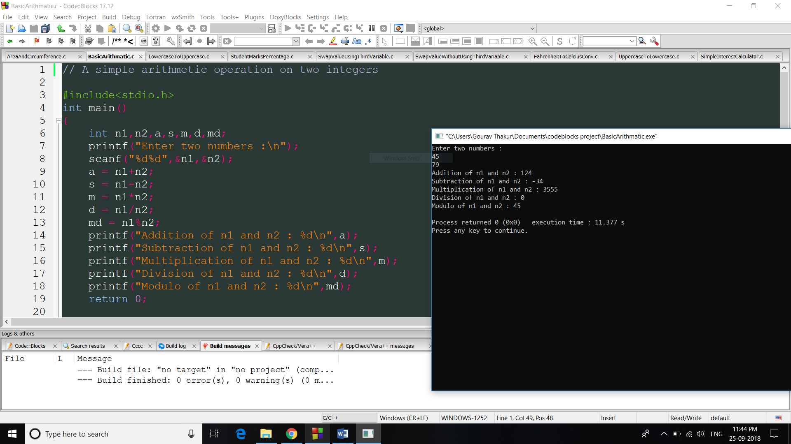

## `C-Language-Problems-and-Solutions`

## :octocat: Fork and :eight_pointed_black_star: star this repo
Simple, short and sweet  beginners friendly C language programs 

“That's the thing about people who think they hate computers. What they really hate is lousy programmers.” 
― Larry Niven

These program are written in codeblocks ide for windows. These programs are not very sophisticated as these are beginners friendly and have many bugs. Anyone who is new to c language can practice these examples. 

- Only programs written in c language will be merged.
- Beautify/Format your code before making a PR. Poorly stuctured code with inconsistent spacing and bad variable name will not be merged. 
- Use this tool to beautify your code : https://codebeautify.org/c-formatter-beautifier
- Make sure your program works after beautifying it.
- #include< stdio.h > is wrong and you must remove whitespaces. #include<stdio.h> is correct.
- Please check your spellings before making a PR
- Comment code properly.

## প্রোগামিং বই:

- [কম্পিউটার প্রোগ্রামিং বই](http://cpbook.subeen.com/)-Tamim Shahriar

- [C Programming Absolute Beginner's Guide](https://usermanual.wiki/Pdf/CProgrammingAbsoluteBeginnersGuide3rdEditio.424140197.pdf)

- [Dawn of Programming Contest](https://docs.google.com/viewer?a=v&pid=sites&srcid=ZGVmYXVsdGRvbWFpbnxzaGFudG84NnxneDplNjM5ZjhlYzYxMWY1N2Q)

- [Data Structures And Algorithms Roadmap](https://github.com/yuvrajverma01/Data-Structures-And-Algorithms-Roadmap)

- [52 Programming Problems and Solution](https://drive.google.com/file/d/1ZvkZOrdpJezviiUGHKmy2BNivtygASsT/view?fbclid=IwAR0cmTdxl8Z6oI-OtTO0wQ5blYZQqLnWsuOPypolDJLs6d-XYncQUeEZmdQ)

- [CP Computer Programming- Tamim Shariar Subeen](https://docs.google.com/file/d/0B2ntYqCgNmgJakVVUDVHR005ZTQ/edit?resourcekey=0-qCavR3wlTDFQ4JLBWrCBbw)

- [50 Basic Programes](https://mycareerwise.com/programming/category/basic-programs)

## প্রোগামিং সমস্যা: 

1. প্রোগামিং সমস্যা - ১ - ( জোড়-বিজোড় ১ )

      [Dimik Oj -প্রোগামিং সমস্যা - ১ - ( জোড়-বিজোড় ১ )|৫২ টি প্রোগামিং সমস্যা ~ Engineering LAB24](https://engineeringlab24.blogspot.com/2019/10/dimik-oj.html)

2. প্রোগামিং সমস্যা - 2 (জোড়-বিজোড় 2)

      [Dimik Oj প্রোগামিং সমস্যা - 2 (জোড়-বিজোড় 2) ~ Engineering LAB24](https://engineeringlab24.blogspot.com/2019/10/dimik-oj-2-2.html)

3. প্রোগামিং সমস্যা - 3 ( অধোগামী সংখ্যা )

      https://engineeringlab24.blogspot.com/2019/10/t-example-output-1000-999-998-997-996.html?m=0

4. প্রোগামিং সমস্যাঃ ভাজক

      [Dimik Oj প্রোগামিং সমস্যা - ৪ - গুণনীয়ক (ভাজক) বের করতে হবে ~ Engineering LAB24](https://engineeringlab24.blogspot.com/2019/10/dimik-oj_8.html)

5. Simple sum - https://www.beecrowd.com.br/judge/en/problems/view/1003

6. Average - https://www.beecrowd.com.br/judge/en/problems/view/1006

7. Time conversion - https://www.beecrowd.com.br/judge/en/problems/view/1019

8. Salary - https://www.beecrowd.com.br/judge/en/problems/view/1008

9. Consumption - https://www.beecrowd.com.br/judge/en/problems/view/1014

10. Simple Sort - https://www.beecrowd.com.br/judge/en/problems/view/1042 

11. Positive Numbers - https://www.beecrowd.com.br/judge/en/problems/view/1060

12. Age in Days - https://www.beecrowd.com.br/judge/en/problems/view/1020	

13. Salary with bonus - https://www.beecrowd.com.br/judge/en/problems/view/1009	

14. Odd or Even - https://www.beecrowd.com.br/judge/en/problems/view/1074	

15. Even Square - https://www.beecrowd.com.br/judge/en/problems/view/1073

16. Simple factorial - https://www.beecrowd.com.br/judge/en/problems/view/1153

17. Prime Number - https://www.beecrowd.com.br/judge/en/problems/view/1165

18. Converting to Hexadecimal - https://www.beecrowd.com.br/judge/en/problems/view/1957

19. Distancce - https://www.beecrowd.com.br/judge/en/problems/view/1016

20. Animal - https://www.beecrowd.com.br/judge/en/problems/view/1049

21. Weighted Averages - https://www.beecrowd.com.br/judge/en/problems/view/1079

22. Ascending and Descending - https://www.beecrowd.com.br/judge/en/problems/view/1113

23. Multiples of 13 - https://www.beecrowd.com.br/judge/en/problems/view/1132

24. Rest of a Division - https://www.beecrowd.com.br/judge/en/problems/view/1133

25. Logical Sequence - https://www.beecrowd.com.br/judge/en/problems/view/1145

## Contributing

This is a personal learning project for me.

Please feel free to fork this repo. Pull request to submit more programs.

